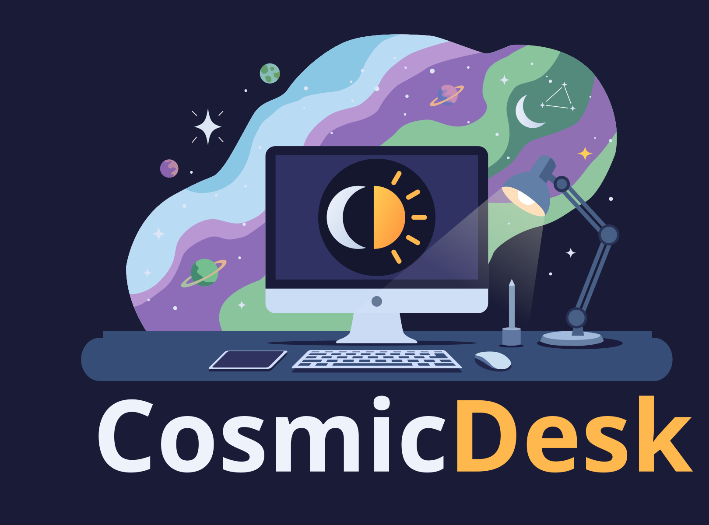

  

A minimal remote desktop tool built on the **Moonlight protocol** and based on the **Sunshine** project.

Cosmic Desk acts as both **client** and **server**, making it easier to use than other moonlight-based alternatives.

## TODOs

File transfer, clipboard sync, gamepads.

## Known limitations

- **Windows: no session-0 service.** A real Windows service cannot capture the
  interactive desktop or inject input into it, so Cosmic Desk autostarts as a per-user
  tray application instead. It therefore cannot be reached before a user logs in, and
  cannot see UAC secure-desktop prompts at the moment.
- **Linux: X11 only.** Wayland capture (portal/PipeWire) is planned but not in v1; log in
  with an Xorg session.
- **Direct connections only.** For access across the internet you must forward these
  ports yourself. They all derive from the `port_base` setting (default 47989); the
  authoritative table lives in [`docs/PROTOCOL.md`](docs/PROTOCOL.md):

  | Port  | Proto     | Purpose                            |
  |-------|-----------|------------------------------------|
  | 47984 | TCP/HTTPS | Pairing completion, authenticated API |
  | 47989 | TCP/HTTP  | `serverinfo`, pairing phases 1-4    |
  | 47998 | UDP       | Video RTP                          |
  | 47999 | UDP       | Control / input (ENet, encrypted)  |
  | 48000 | UDP       | Audio RTP                          |
  | 48010 | TCP       | RTSP                               |

## Building

See [`docs/BUILDING.md`](docs/BUILDING.md). In short:

- **Windows:** MSYS2 **UCRT64** shell (MSVC is not supported — the vendored host code
  requires GCC/Clang), then `cmake -B build -G Ninja && ninja -C build`.
- **Linux:** install the listed `apt` packages, then the same CMake commands.

## Releases

Tagged (`v*`) releases are published from CI on the
[releases page](https://github.com/bro-santana/cosmic-desk/releases), each carrying:

- `CosmicDesk-windows-x64.zip` — self-contained Windows bundle (unzip and run)
- `CosmicDesk-windows-x64-setup.exe` — Inno Setup per-user installer (unsigned;
  SmartScreen will warn)
- `cosmicdesk-linux-x64.tar.gz` — Linux tarball (no root required; udev rule is manual)
- `cosmicdesk_<version>_amd64.deb` — Package targeting **Ubuntu 24.04+**
  (`sudo apt install ./cosmicdesk_<version>_amd64.deb`; input injection works out of
  the box)

A rolling `nightly` prerelease carries the same four artifacts from the `develop`
branch.

## Documentation

| Document | Contents |
|---|---|
| [`PLAN.md`](PLAN.md) | Architecture, design decisions, milestones, risks |
| [`docs/BUILDING.md`](docs/BUILDING.md) | Toolchain setup and troubleshooting |
| [`docs/PROTOCOL.md`](docs/PROTOCOL.md) | Ports, pairing flow, and the Cosmic protocol extensions |
| [`docs/VENDOR.md`](docs/VENDOR.md) | **Provenance of every piece of copied code** |

## Code provenance & licensing

**Cosmic Desk is assembled from existing open-source projects.**
The streaming stack — capture, encoding, pairing, RTSP, and the client-side
protocol core — comes from mature GPL-3.0 projects.

[`docs/VENDOR.md`](docs/VENDOR.md) is the authoritative inventory: it lists every
component, the exact upstream revision it was taken from, whether it was modified, and
how to diff our copy against upstream. The table below is a summary of it.
Modifications to vendored files are marked inline with `COSMIC MODIFICATION` comments.

| Upstream project | Licence | What we use it for |
|---|---|---|
| [Sunshine](https://github.com/LizardByte/Sunshine) | GPL-3.0 | The host role: GameStream HTTP/HTTPS server, pairing state machine, RTSP, control stream, screen capture, encoding, audio, input injection |
| [moonlight-common-c](https://github.com/moonlight-stream/moonlight-common-c) | GPL-3.0 | The viewer protocol core: RTSP client, control stream, RTP depacketization, FEC, input events |
| [moonlight-embedded](https://github.com/moonlight-stream/moonlight-embedded) | GPL-3.0 | Client-side pairing (`libgamestream`), plus the FFmpeg-decode / SDL-render / Opus-playback structure |
| [moonlight-qt](https://github.com/moonlight-stream/moonlight-qt) | GPL-3.0 | Keyboard-grab and fullscreen handling, and the SDL-scancode-to-Windows-VK translation table |
| [Dear ImGui](https://github.com/ocornut/imgui) | MIT | All user interface |
| [tray](https://github.com/zserge/tray) | MIT | Tray icon and menu |
| [Simple-Web-Server](https://github.com/LizardByte-infrastructure/Simple-Web-Server) | MIT | Header-only HTTP(S) server used by the vendored Sunshine host (`nvhttp`) |
| [libdisplaydevice](https://github.com/LizardByte/libdisplaydevice) | AGPL-3.0 | Display enumeration for the host's monitor list |
| [nv-codec-headers](https://github.com/FFmpeg/nv-codec-headers) | MIT | NVENC API headers for the host's NVENC encoder |
| [nvapi](https://github.com/NVIDIA/nvapi) | MIT | NVIDIA NVAPI headers used by the vendored `nvprefs` code |
| [glad](https://github.com/Dav1dde/glad) | MIT | GL/EGL loader generator used by the Linux VAAPI build |
| [inputtino](https://github.com/games-on-whales/inputtino) | MIT | Linux uinput input injection (host) |
| Sunshine DXGI HLSL capture shaders ([Sunshine](https://github.com/LizardByte/Sunshine)) | GPL-3.0 | Windows capture shaders in `assets/shaders/` |

Because Cosmic Desk builds on GPL-3.0 code, **Cosmic Desk is licensed under GPL-3.0** —
see [`LICENSE`](LICENSE). One vendored component, libdisplaydevice, is AGPL-3.0;
combining it with the GPL-3.0 code makes the combined work subject to AGPL-3.0 terms.
Cosmic Desk is not affiliated with or endorsed by the LizardByte or Moonlight projects.

  

